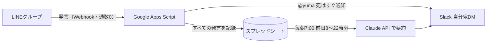

# LINEグループ → Slack 通知

事業用 LINE グループに入っている公式LINE（Messaging API）を使って、次の2つを行うしくみです。

1. **@yuma 宛のメッセージを、届いた瞬間に Slack の自分宛 DM に通知**
2. **毎朝 7:00 に、前日 8:00〜22:00 のトークの「変更点・決まったこと・依頼」などを AI で要約して Slack に通知**

Google Apps Script（無料）で動きます。サーバーの用意はいりません。

## LINE の無料メッセージ通数は使いません

- 公式LINEは、グループの発言を **受け取る（Webhook）** ことと **送信者名を調べる** ことしかしません。公式LINEからメッセージを送らないので、通数は **0通** です。
- 通知は Slack に送ります（Slack の無料プランで使えます）。
- 公式LINEから個別トークで通知する方法（プッシュメッセージ）は、1回ごとに通数を消費するので使っていません（無料の LINE Notify は 2025年3月で終了しています）。

> 参考：いまの Gmail 通知のように **グループへ** プッシュ送信すると、1回で「グループの人数分」の通数が消費されます。

## しくみ



## 通知の例

**@yuma 宛のメッセージ**（届いた瞬間）

```
🔔 LINEで @yuma 宛のメッセージ
事業グループ｜佐藤｜10/1(木) 10:15
> @ゆうま 明日の清掃、11時からに変更でお願いします
LINEを開く
```

**毎朝 7:00 の要約**

```
📋 事業グループ 10/1(木) 8:00〜22:00 のまとめ（48件）

🔄 変更点
• 10/3 の清掃：10時 → 11時に変更（佐藤）
• 302号室のチェックイン：15時 → 16時（田中、編集で変更）
👤 yumaさん宛て
• 請求書の確認依頼（田中）
📌 依頼・TODO
• シャンプーの補充：佐藤さんが 10/2 中に対応
❓ 未解決・要確認
• 来週の定例の日程が未定
```

### 「@yuma 宛」と判定する発言

| 判定 | 説明 |
| --- | --- |
| メンション | LINE の @メンション機能で自分が指名された（`MY_LINE_USER_ID` の設定が必要） |
| キーワード | 本文に `@yuma`・`@ゆうま`・`@ユウマ` または「@自分のLINE表示名」が含まれる（全角・半角、大文字・小文字は区別しない。表示名での判定は `MY_LINE_USER_ID` の設定が必要） |
| 返信 | 自分の発言へのリプライ（引用返信）（`MY_LINE_USER_ID` の設定が必要） |
| @All | 全員へのメンション（初期設定では通知しない） |

自分自身の発言は通知しません。キーワードや通知する条件は `gas/Code.gs` 冒頭の `CONFIG` で変えられます。

あとから **編集** された発言は記録と通知を書き換え、**送信取消** された発言は記録から内容を消して、Slack の通知も「送信取消されました」に書き換えます。

---

## 用意するもの

- 公式LINEの **チャネルアクセストークン（長期）**（いまの Gmail 通知で使っているものと同じでOK）
- **Slack** のワークスペース（自分宛 DM に通知します）
- **Claude API キー**（要約用・従量課金。なくても、要約の代わりに発言一覧が届きます）
- Google アカウント

## セットアップ（20〜30分）

### 1. Slack アプリを作る（通知の送り先）

1. <https://api.slack.com/apps> を開き、**Create New App** → **From scratch**
   - App Name: `LINE通知` など、ワークスペース: 通知を受け取るワークスペース
2. 左メニュー **OAuth & Permissions** → **Scopes** → **Bot Token Scopes** に `chat:write` を追加
3. 左メニュー **App Home** → **Show Tabs** の **Messages Tab** をオン
4. 左メニュー **Install App** → **Install to Workspace** → 許可
   - 表示される **Bot User OAuth Token**（`xoxb-` で始まる）を控える → `SLACK_BOT_TOKEN`
   - ワークスペースの設定によっては、管理者の承認が必要です
5. Slack で自分のプロフィールを開き、**︙（その他）** → **メンバーIDをコピー**（`U` で始まる） → `SLACK_USER_ID`

<details>
<summary>Bot の代わりに Incoming Webhook を使う場合</summary>

Slack アプリの **Incoming Webhooks** をオンにして、通知したいチャンネルの Webhook URL を作り、`SLACK_WEBHOOK_URL` に設定します（`SLACK_BOT_TOKEN` は空のまま）。`SLACK_USER_ID` も設定しておくと、通知で自分がメンションされるので、スマホにも通知が届きやすくなります。この方式では、編集・送信取消のときに Slack の通知を書き換えられません。
</details>

### 2. Claude API キーを作る（要約用）

1. Claude Console（<https://platform.claude.com/>、旧 console.anthropic.com）にログイン
2. **Billing** でクレジットを購入（前払い）
3. **API Keys** → **Create Key** → 表示されたキー（`sk-ant-` で始まる）を控える → `ANTHROPIC_API_KEY`

### 3. Google Apps Script を用意する

1. Google スプレッドシートを新しく作る（例：「LINEグループ 記録」）。ここに発言が記録されます
2. メニューの **拡張機能** → **Apps Script**
3. 最初からある `コード.gs` の中身をすべて消し、このリポジトリの [`gas/Code.gs`](gas/Code.gs) の内容を貼り付けて保存（💾）
4. 左の ⚙ **プロジェクトの設定** → タイムゾーンを「(GMT+09:00) 日本標準時 - 東京」にする

いまの Gmail 通知のスクリプトとは **別のプロジェクト** にしてください（同じプロジェクトに入れると関数名がぶつかることがあります）。

### 4. スクリプト プロパティを設定する

⚙ **プロジェクトの設定** → いちばん下の **スクリプト プロパティ** → **スクリプト プロパティを追加** で登録します。

| プロパティ | 値 | |
| --- | --- | --- |
| `LINE_CHANNEL_ACCESS_TOKEN` | LINE Developers → 公式LINEのチャネル → **Messaging API設定** → **チャネルアクセストークン（長期）** | 必須 |
| `SLACK_BOT_TOKEN` | 手順1の `xoxb-…` | 必須※ |
| `SLACK_USER_ID` | 手順1の `U…` | 必須※ |
| `ANTHROPIC_API_KEY` | 手順2の `sk-ant-…` | 推奨 |
| `MY_LINE_USER_ID` | 自分の LINE ユーザーID（手順7で設定） | 推奨 |
| `TARGET_GROUP_ID` | 対象を1つのグループに絞る場合のグループID（記録シートの「グループID」列） | 任意 |
| `SLACK_WEBHOOK_URL` | Bot の代わりに Incoming Webhook を使う場合 | 任意 |

※ Incoming Webhook を使う場合は `SLACK_WEBHOOK_URL` で代わりになります。

> ⚠️ LINE Developers でチャネルアクセストークンの **「再発行」は押さないでください**。いまのトークンが使えなくなり、Gmail 通知が止まります。表示されているトークンをそのままコピーすれば大丈夫です。

### 5. `setup` を実行する

1. エディタ上部の関数の選択欄で `setup` を選び、**▶ 実行**
2. 初回は権限の確認が出ます：**権限を確認** → アカウントを選ぶ → 「Google で確認されていません」と出たら **詳細** → **（プロジェクト名）に移動** → **許可**
3. 下の実行ログに **Webhook 用キー** と設定状況が表示されます（❌ がないか確認）
4. 関数 `testSlack` を実行して、Slack にテスト通知が届くことを確認

`setup` は記録シート・毎朝の要約トリガーを作ります。何度実行しても大丈夫です。

### 6. ウェブアプリとして公開し、LINE の Webhook に設定する

1. 右上の **デプロイ** → **新しいデプロイ** → 種類の選択（⚙）で **ウェブアプリ**
   - 次のユーザーとして実行：**自分**
   - アクセスできるユーザー：**全員**
2. **デプロイ** を押し、表示された **ウェブアプリの URL**（`https://script.google.com/macros/s/…/exec`）をコピー
3. URL の末尾に `?key=（手順5のキー）` を付ける
   - 例：`https://script.google.com/macros/s/AKfy…/exec?key=0123abcd…`
4. [LINE Developers コンソール](https://developers.line.biz/console/) → 公式LINEのチャネル → **Messaging API設定**
   - **Webhook URL** に 3. の URL を貼って **更新**
   - **Webhookの利用** をオン
   - **Webhookの再送** はオフのまま（推奨）
   - **検証** を押して「成功」と出ればOK
5. LINE Official Account Manager → **設定** → **応答設定** で **Webhook** がオンになっていることを確認
6. グループで「@yuma テスト」と発言 → Slack に通知が届き、記録シートの「トーク履歴」に行が増えれば成功です

> Webhook URL は1つのチャネルに1つしか設定できません。いまの Gmail 通知のスクリプトが Webhook URL を使っていた場合（グループIDを調べるために設定した場合など）、そちらには届かなくなります。Gmail 通知の送信（プッシュ）自体は Webhook を使わないので、影響はありません。

### 7. 自分の LINE ユーザーID を設定する（推奨）

1. 記録シートの「トーク履歴」で、手順6で自分が送った行の **ユーザーID**（`U` で始まる33文字）をコピー
2. スクリプト プロパティ `MY_LINE_USER_ID` に設定

これで、LINE の @メンション機能で自分を指名した発言と、自分の発言へのリプライも通知されるようになり、自分の発言は通知されなくなります。

### 8. 要約を試す

関数 `testSummaryToday` を実行すると、**今日の 8:00〜今** の発言を要約して Slack に送ります。あとは毎朝 7:00 に前日分が自動で届きます。

---

## 設定を変える

`gas/Code.gs` 冒頭の `CONFIG` を書き換えて保存します。

| 項目 | 初期値 | 内容 |
| --- | --- | --- |
| `OWNER_NAME` | `'yuma'` | 通知や要約での自分の呼び名 |
| `MENTION_KEYWORDS` | `['@yuma', '@ゆうま', '@ユウマ']` | 本文に含まれていたら通知する文字 |
| `NOTIFY_REPLY_TO_ME` | `true` | 自分の発言へのリプライも通知する |
| `NOTIFY_MENTION_ALL` | `false` | @All も通知する |
| `SUMMARY_START_HOUR` / `SUMMARY_END_HOUR` | `8` / `22` | 要約する時間帯（前日の 8:00〜22:00） |
| `SUMMARY_SEND_HOUR` | `7` | 要約を送る時刻（変えたら `setup` を再実行） |
| `SEND_EMPTY_SUMMARY` | `true` | 発言がない日も「発言なし」と送る |
| `BUSINESS_CONTEXT` | `''` | 事業の説明。例：`'民泊の運営（予約・清掃・備品の管理）'`。書くと要約の精度が上がります |
| `CLAUDE_MODEL` | `'claude-opus-5-5'` | 要約に使う AI。`'claude-sonnet-5-5'` にすると約半額で速くなります |
| `CLAUDE_EFFORT` | `'low'` | AI が考える深さ（`low` / `medium` / `high`） |
| `LOG_RETENTION_DAYS` | `90` | 記録を残す日数 |

**コードを書き換えたあとは、Webhook 側にも反映するために再デプロイが必要です：**
**デプロイ** → **デプロイを管理** → ✏️（編集）→ バージョン「**新バージョン**」→ **デプロイ**。
URL は変わりません（「新しいデプロイ」を作ると URL が変わるので注意）。

## 手動で使える関数

| 関数 | 内容 |
| --- | --- |
| `setup` | 初期設定・設定状況の表示（何度実行してもOK） |
| `testSlack` | Slack にテスト通知を送る |
| `testSummaryToday` | 今日の 8:00〜今 の要約を送る |
| `sendYesterdaySummaryNow` | 前日分の要約を今すぐ送る（朝の送信が失敗したときなど） |

## 記録シート「トーク履歴」

1行が1発言です。左から 日時・送信者・内容・種類・自分宛（通知した理由）・状態（編集済み／送信取消）・編集前の内容…と並びます。
`LOG_RETENTION_DAYS`（初期値90日）より古い行は、毎朝の要約のあとに自動で削除されます。

## 知っておいてほしいこと

- **公式LINE自身が送ったメッセージ（Gmail 通知など）は要約に含まれません。** LINE の仕様で、公式アカウントには自分の送信が Webhook で届かないためです。含めたい場合は、Gmail 通知のスクリプト側から記録シートに書き込む改修が必要です。
- 公式LINEがグループに入る前や、Webhook を設定する前の発言は取得できません。
- **PC版 LINE** から送られた発言は、LINE の仕様で送信者のユーザーIDが届かず、送信者が「不明」になることがあります（内容は記録・要約されます）。
- @メンションされた人が公式アカウントへのプロフィール提供に同意していないと、メンションに相手のユーザーIDが付きません。その場合も「@表示名」の文字とキーワードで判定します。
- 要約のときに、前日の発言内容が Anthropic（Claude API）に送られます。グループのメンバーには、公式LINEが発言を記録・要約していることを伝えておくのがおすすめです。
- Apps Script の起動に時間がかかると、LINE Developers のエラー統計に「タイムアウト」が記録されることがあります。Webhook の再送をオフにしておけば二重に処理されることはなく、記録シートに行が増えていれば正常に動いています。

## 費用の目安

| | 費用 |
| --- | --- |
| LINE | 0円（メッセージ通数を消費しません） |
| Google Apps Script・スプレッドシート | 0円 |
| Slack | 0円（無料プランで可） |
| Claude API | 1日1回の要約のみ。発言100件／日なら1回あたり10円前後（月300円程度）が目安 |

Claude Opus 5.5 の料金は、入力 100万トークンあたり $4、出力 100万トークンあたり $20 です。発言が少ない日はもっと安く、発言がない日はかかりません。

## うまく動かないとき

| 症状 | 確認すること |
| --- | --- |
| Slack に何も届かない | `testSlack` を実行してエラー内容を確認。`invalid_auth` → `SLACK_BOT_TOKEN`、`channel_not_found` → `SLACK_USER_ID`、`messages_tab_disabled` → 手順1の3（Messages Tab をオン） |
| 記録シートに行が増えない | Webhook URL の末尾の `?key=…`、**Webhookの利用** がオンか、デプロイの「アクセスできるユーザー」が **全員** か、コード変更後に **新バージョン** で再デプロイしたか |
| 送信者が「不明」になる | `LINE_CHANNEL_ACCESS_TOKEN` の設定。PC版 LINE からの発言は仕様で不明になることがあります |
| 要約の代わりに発言一覧が届く | Slack のメッセージにエラー内容が書かれています（API キーの間違い、クレジット残高不足など） |
| 朝の要約が届かない | Apps Script の左メニュー **トリガー** に `prepareDailySummary` があるか（なければ `setup` を実行）。**実行数** でエラーを確認 |

Apps Script の左メニュー **実行数** で、各処理のログとエラーを確認できます。

---

## 開発者向け

- 本体は [`gas/Code.gs`](gas/Code.gs) の1ファイルです（[`gas/appsscript.json`](gas/appsscript.json) はマニフェスト）。
- `npm test`（Node.js 18 以上）で、Apps Script のサービス（スプレッドシート・キャッシュ・トリガー・UrlFetch）をまねたモックの上で、Webhook の処理から要約の送信までをテストできます。
- [clasp](https://github.com/google/clasp) を使う場合は、`gas/` を `rootDir` にして `clasp push` できます。
